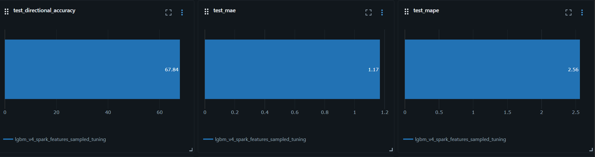
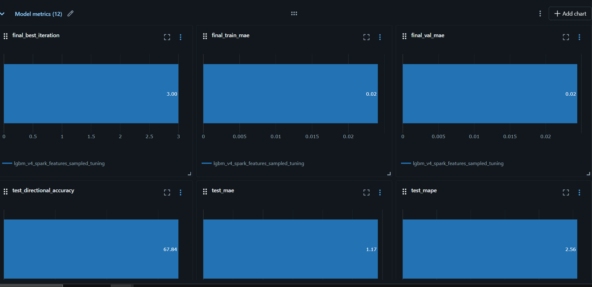

<p align="center">
  
</p>


<h2 align="center">
SAIA  is an AI-powered financial intelligence platform for stock analysis and prediction
It combines traditional market data with financial news sentiment to deliver smarter investment insights
</h2>

<p align="center">
  <a href="https://drive.google.com/file/d/17zyRsBWq9K9m2-3hd9UsK96SLm-tYAV7/view?usp=drive_link">
    
  </a>
  <a href="docs/SAIA_Document.pdf">
    
  </a>
</p>

# 📌 Project Overview

SAIA (Stock and Arrows Investing App) is an AI-powered financial intelligence platform that combines traditional stock market analysis with news sentiment intelligence to provide more reliable investment insights

The platform continuously collects market data and financial news, processes them through automated data pipelines, applies machine learning and NLP models, and presents predictions, sentiment analysis, and interactive visualizations through a modern web application and Power BI dashboards


# 🧰 Tools & Technologies
[]()
[]()
[]()
[]()

[]()
[]()
[]()
[]()
[]()
[]()
[]()
[]()
[]()
[]()
[]()
[]()
[]()
[]()


# 🎯 Project Objectives

* Build an end-to-end financial intelligence platform for stock market analysis and prediction.
* Analyze and generate insights for 13,599+ stocks across multiple global stock exchanges.
* Collect and process market-moving financial news from relevant sources.
* Apply NLP-based sentiment analysis to measure the impact of news on stock prices.
* Combine traditional market analysis with AI-driven sentiment analysis into a unified prediction framework.
* Develop machine learning models to improve stock price forecasting.
* Deliver interactive investment insights through a modern web application and Power BI dashboards.

# ⚡ Challenges

* Processing large-scale market data for 13,599+ stocks across multiple exchanges.
* Collecting and filtering high-quality financial news from diverse sources.
* Linking news articles to the correct stocks and market events.
* Building scalable data pipelines for market data and news ingestion.
* Combining structured market data with unstructured text for unified analysis.
* Improving prediction reliability by integrating machine learning with NLP-based sentiment analysis.
* Delivering fast, interactive analytics through a web application and Power BI dashboards.


# 📊 Data Engineering

## Data Engineering Objectives

The data engineering layer was designed to:

* Collect and centralize stock market and financial news data.
* Ensure data quality through validation and cleansing.
* Build scalable ETL/ELT pipelines for automated data processing.
* Support large-scale analytics and machine learning workloads.
* Deliver analytics-ready datasets for prediction and visualization.

## Data Engineering Architecture

* Medallion Architecture (Bronze → Silver → Gold)

# Overall System Architecture


---

## Components

* Stock Market Data APIs
* Financial News APIs
* Databricks Workspaces
* Apache Spark Processing
* Delta Lake Storage
* Lakeflow Job Orchestration
* Databricks Asset Bundles

---

## Data Warehouse Schema
* Star Schema
  


---

## Pipeline Stages

The data pipelines continuously ingest stock market data and financial news, validate and transform the incoming records using Apache Spark, enrich market data with sentiment information, and publish analytics-ready datasets for machine learning models, Power BI dashboards, and the web application.

* Market Data Extraction
* Financial News Collection
* Data Validation & Cleansing
* Data Transformation
* Sentiment Analysis
* Feature Engineering
* Gold Layer Publishing
* Analytical Serving

### Pipeline Screenshots

* Master Job


* Extract Job


* Transformation Job


* Serving Job


* Companies Job


* News Job


---

##  Data Engineering Summary

| Metric | Value |
|---------|------:|
| Data Sources | 5 |
| Stock Price Records | 17M+ |
| Stocks Covered | 17,000+ |
| News Articles Processed | 500K+ |
| Time Period | 2022 – Present |
| Storage Engine | Delta Lake |
| Loading Strategy | Incremental ETL |

---

# 🤖 Machine Learning & Sentiment Enrichment Layer


## ML Layer Objectives

* Turn raw news text into a usable signal by scoring how positive, negative, or neutral it is toward each company.
* Forecast tomorrow's closing price for every covered company, not just a handful of favorites.
* Combine price history and news sentiment into a single predictive model.
* Track every run so results can be compared and reproduced over time.

## Sentiment Scoring — How & Why

* Only new articles are processed each run, not the whole history from scratch — keeps it fast and cheap as data grows.
* Raw news text is normalized first (inconsistent formatting, missing fields, mixed date formats) so scoring stays clean and comparable.
* Each article is matched to a stable identity, so re-runs correct existing scores instead of creating duplicates.
* A language model trained on financial text reads each article and returns three scores — positive, negative, neutral — feeding a daily "mood" signal per company.

## Price Prediction — How & Why

* Feature computation was rebuilt to run in a distributed, vectorized way instead of one company at a time, cutting runtime from minutes to seconds regardless of company count.
* Hyperparameter search runs first on a small random sample of companies, then the final model is retrained on the full dataset — cheap to search, without ever peeking at future data.
* News is aligned to the next trading day instead of being dropped on weekends/holidays, preserving signal that would otherwise be lost.
* All price/volume inputs are relative (returns, ratios, distance from a rolling average), so the model generalizes across low- and high-priced stocks alike.
* The prediction target is based on the dividend/split-adjusted price, so a stock split doesn't look like a fake loss.
* Data is split strictly by time — train / tune / final-test — so reported accuracy reflects real unseen performance, not data the model was indirectly tuned on.
* Companies with too little history simply get no forecast that day, rather than a fabricated one.

## Evaluation

* Scored only against the final, untouched time slice — never data used for training or tuning.
* Metrics: closeness of dollar forecasts, and directional accuracy (up/down calls), where consistently landing above ~53–55% is considered a meaningful trading signal.

### MLflow Results




---

# 💻 Web Application & AI Chatbot

Beyond the pipelines and dashboards above, SAIA ships as a full web product: a browser frontend, a backend service, and a conversational AI assistant, all deployed together as a single service.

## Architecture

```
Browser (SAIA frontend)  --calls-->  Backend service  --calls-->  Data warehouse (Gold layer)
                                            |
                                            +--> AI chatbot agent
```

**The idea:** the browser can never safely hold the credentials needed to query the data warehouse directly, and the warehouse's own API isn't built to be called from arbitrary browser origins. So a small server sits in between — it's the only place those credentials are ever used, and it reads clean, ready-to-use data straight from the platform's Gold layer: company snapshots, full daily price history, sentiment-scored news, and the latest price forecasts. The frontend itself is a single page served directly by that same backend, so the whole product lives on one deployment with nothing separate to keep in sync.

The chatbot is an AI agent that answers questions using the platform's own live data — companies, prices, news, forecasts, watchlists — by calling back into the backend for real numbers, instead of guessing from its own memory.

## API Endpoints

| Endpoint | Description |
|---|---|
| `GET /api/companies` | Company snapshot data |
| `GET /api/stock-prices?ticker=` | Full daily price history for a ticker |
| `GET /api/news?ticker=` | News + sentiment (ticker optional) |
| `GET /api/news/search?q=` | Server-side free-text news search |
| `GET /api/predictions` | Latest 30-day ML price predictions |
| `GET /api/watchlist?email=` / `POST /api/watchlist/toggle` | Per-user watchlist |
| `GET /api/saved-news?email=` / `POST /api/saved-news/toggle` | Saved articles |
| `POST /api/chat` | Conversational endpoint powered by the AI agent |
| `GET /health`, `GET /v1/health` | Health checks |

## AI Chatbot Design

The chatbot follows a simple decision chain: it reads the question, decides whether it needs live data or can answer directly, and if it does need data, it calls out to fetch it and then continues to a final answer.

* **Why it calls out for data instead of just answering** — an AI model on its own doesn't actually know today's prices or this week's news; it can only guess or make things up. Letting it call back into the platform for real, current numbers is what keeps its answers grounded in fact.
* **Memory** — each conversation keeps its own running history, so the chat is multi-turn without the frontend needing to resend everything on every message; that history is trimmed down before each model call so long conversations don't balloon in cost.
* **Persistent chat history** — every signed-in user's conversations are stored so they survive a restart and follow the user across devices, and each user can hold several separate conversations, similar to a chat-app sidebar.
* **Durable user facts** — after each reply, a lightweight background step checks whether the turn revealed a new durable fact about the user (name, stated preference, etc.) and remembers it, so even a brand-new conversation can already know things learned earlier.
* **Fallback across multiple keys** — the underlying model can be configured with more than one API key, with automatic fallback if one hits its usage limit or is revoked, and clear error messages are surfaced when all configured keys are exhausted.

## Local Development Mode

For local development or demos without a live connection to the data warehouse, the backend can be switched into a mode that serves the same data shape from local files instead — every endpoint behaves identically either way, so the frontend and chatbot need no changes to work with it.

---

#  📈 Power BI


# 👨‍💻 Team Members

### Abdallah Mohamed Abdelzaher

Data Engineering • MLops • NLP • Fullstack

[](https://www.linkedin.com/in/abdallahabdelzaher)
[](https://github.com/AbdallahAbdElzaher24)

### Omar Ahmed Wahby

Data Engineering • Business Intelligence • Power BI • Analytics

[](https://www.linkedin.com/in/omarwahby)
[](https://github.com/OmarAhmedWahby)

### Abdelrahman Mohamed Ibrahim

Data Engineering • Data Analysis • Machine learning

[](https://www.linkedin.com/in/abdelrahmanmohammedds/)
[](https://github.com/Abdelrahman-mohamed-DS)